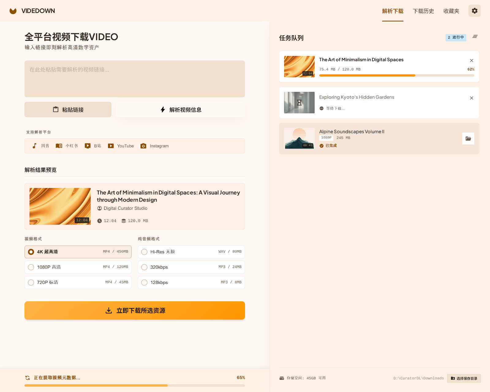

<div align="center">
  <h1>Videdown</h1>
</div>

Videdown 是一款现代化的开源视频下载工具，让你可以从抖音 小红书 B站 YT Instagram等网站下载无水印高清视频。基于 Electron 构建，使用 yt-dlp 作为下载引擎，Videdown 提供了简洁直观的界面和强大的功能，满足你的所有下载需求。

  <p>
    <a href="https://github.com/cshuangyy/videdown/stargazers"></a>
    <a href="https://github.com/cshuangyy/videdown/releases"></a>
    <a href="https://github.com/cshuangyy/videdown/releases/latest"></a>
    <br />
    <br />
  </p>

## 👋🏻 开始使用

Videdown 目前正在积极开发中，欢迎反馈任何[问题](https://github.com/cshuangyy/videdown/issues)。

[📥 下载 Videdown](https://github.com/cshuangyy/videdown/releases)

> [!IMPORTANT]
>
> **Star 我们**，你将第一时间收到 GitHub 的所有版本更新通知~

## ✨ 功能特性

### 🌍 全球视频下载支持

通过强大的 yt-dlp 引擎，可以从全球几乎所有网站下载视频。支持 1000+ 个网站，包括 YouTube、抖音、B站、小红书、Instagram 等。

### 🎨 一流的界面体验

现代化、简洁的界面，操作直观。一键暂停/恢复/重试，实时进度追踪，全面的下载队列管理。

### 📊 实时下载进度

显示下载进度、下载速度、预计剩余时间，让你随时掌握下载状态。

### 🍪 Cookie 支持

支持导入浏览器 Cookie，可以下载需要登录的视频内容。

### 🎵 多格式选择

支持选择不同的视频质量和格式，包括仅下载音频。

## 🌐 支持的网站

Videdown 通过 yt-dlp 支持 1000+ 个视频和音频平台。主要支持：

- **国内平台**：抖音、B站（哔哩哔哩）、小红书、快手、西瓜视频
- **国际平台**：YouTube、Instagram、TikTok、Twitter/X、Facebook
- **其他**：支持几乎所有 yt-dlp 支持的网站

完整支持列表请访问 [yt-dlp 支持网站](https://github.com/yt-dlp/yt-dlp/blob/master/supportedsites.md)

## 🚀 安装使用

### 下载安装

1. 访问 [Releases](https://github.com/cshuangyy/videdown/releases) 页面
2. 下载最新版本的安装程序 `Videdown Setup x.x.x.exe`
3. 运行安装程序，按提示完成安装
4. 安装完成后即可使用

### 从源码构建

#### 1. 克隆仓库

```bash
git clone https://github.com/cshuangyy/videdown.git
cd videdown
```

#### 2. 下载依赖工具

本项目需要 **yt-dlp** 和 **ffmpeg** 才能正常运行。

**Windows 用户：**

```powershell
# 下载 yt-dlp
Invoke-WebRequest -Uri "https://github.com/yt-dlp/yt-dlp/releases/latest/download/yt-dlp.exe" -OutFile "yt-dlp.exe"

# 下载 ffmpeg
Invoke-WebRequest -Uri "https://github.com/BtbN/FFmpeg-Builds/releases/download/latest/ffmpeg-master-latest-win64-gpl.zip" -OutFile "ffmpeg.zip"
Expand-Archive -Path "ffmpeg.zip" -DestinationPath "."
Copy-Item -Path "ffmpeg-master-latest-win64-gpl/bin/ffmpeg.exe" -Destination "ffmpeg.exe"
Remove-Item -Path "ffmpeg.zip" -Recurse -Force
Remove-Item -Path "ffmpeg-master-latest-win64-gpl" -Recurse -Force
```

**macOS/Linux 用户：**

```bash
# 使用包管理器安装 yt-dlp 和 ffmpeg
# macOS (Homebrew)
brew install yt-dlp ffmpeg

# Ubuntu/Debian
sudo apt update
sudo apt install yt-dlp ffmpeg

# Arch Linux
sudo pacman -S yt-dlp ffmpeg
```

#### 3. 安装项目依赖

```bash
pnpm install
```

#### 4. 运行和构建

```bash
# 开发模式运行
pnpm dev

# 构建生产版本
pnpm build
```

## 📖 使用说明

### 基本使用

1. 复制视频链接（支持抖音、B站、YouTube、Instagram 等）
2. 粘贴到软件输入框
3. 点击"解析"按钮
4. 选择想要的画质和格式
5. 点击"下载"按钮

### YouTube 下载

对于需要登录的 YouTube 视频：

1. 安装 Chrome 扩展 "Get cookies.txt"
2. 在 YouTube 页面导出 cookies
3. 在软件设置中导入 cookies 文件
4. 即可下载受限视频

## 🛠️ 技术栈

- **Electron** - 跨平台桌面应用框架
- **Vue 3** - 渐进式 JavaScript 框架
- **TypeScript** - 类型安全的 JavaScript 超集
- **Tailwind CSS** - 实用优先的 CSS 框架
- **YT-DLP** - 强大的视频下载引擎
- **FFmpeg** - 音视频处理工具

## 📁 项目结构

```
videdown/
├── electron/           # Electron 主进程代码
│   ├── main.ts        # 主进程入口
│   └── preload.ts     # 预加载脚本
├── src/               # 渲染进程代码
│   ├── components/    # Vue 组件
│   ├── assets/        # 静态资源
│   └── App.vue        # 根组件
├── public/            # 公共资源
└── package.json       # 项目配置
```

## 🤝 贡献指南

欢迎提交 Issue 和 Pull Request！

1. Fork 本仓库
2. 创建您的特性分支 (`git checkout -b feature/AmazingFeature`)
3. 提交您的更改 (`git commit -m 'Add some AmazingFeature'`)
4. 推送到分支 (`git push origin feature/AmazingFeature`)
5. 打开一个 Pull Request

## 💖 支持作者

如果这个项目对你有帮助，可以考虑请作者喝杯咖啡 ☕

<div align="center">
  <table>
    <tr>
      <td align="center">
        
        <br>
        <sub>微信支付</sub>
      </td>
      <td align="center">
        
        <br>
        <sub>支付宝</sub>
      </td>
    </tr>
  </table>
</div>

## 📄 开源协议

本项目基于 [MIT](LICENSE) 协议开源。

```
MIT License

Copyright (c) 2024 Videdown

Permission is hereby granted, free of charge, to any person obtaining a copy
of this software and associated documentation files (the "Software"), to deal
in the Software without restriction, including without limitation the rights
to use, copy, modify, merge, publish, distribute, sublicense, and/or sell
copies of the Software, and to permit persons to whom the Software is
furnished to do so, subject to the following conditions:

The above copyright notice and this permission notice shall be included in all
copies or substantial portions of the Software.

THE SOFTWARE IS PROVIDED "AS IS", WITHOUT WARRANTY OF ANY KIND, EXPRESS OR
IMPLIED, INCLUDING BUT NOT LIMITED TO THE WARRANTIES OF MERCHANTABILITY,
FITNESS FOR A PARTICULAR PURPOSE AND NONINFRINGEMENT. IN NO EVENT SHALL THE
AUTHORS OR COPYRIGHT HOLDERS BE LIABLE FOR ANY CLAIM, DAMAGES OR OTHER
LIABILITY, WHETHER IN AN ACTION OF CONTRACT, TORT OR OTHERWISE, ARISING FROM,
OUT OF OR IN CONNECTION WITH THE SOFTWARE OR THE USE OR OTHER DEALINGS IN THE
SOFTWARE.
```

## 🙏 致谢

- [yt-dlp](https://github.com/yt-dlp/yt-dlp) - 强大的视频下载引擎
- [FFmpeg](https://ffmpeg.org/) - 音视频处理解决方案
- [Electron](https://www.electronjs.org/) - 跨平台桌面应用框架
- [Vue.js](https://vuejs.org/) - 渐进式 JavaScript 框架
- [Vite](https://vitejs.dev/) - 下一代前端构建工具
- [Tailwind CSS](https://tailwindcss.com/) - 实用优先的 CSS 框架

---

Made with ❤️ by Videdown Team
